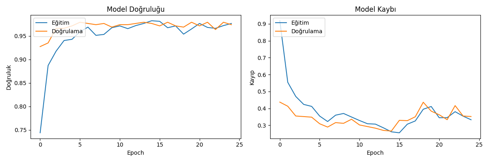
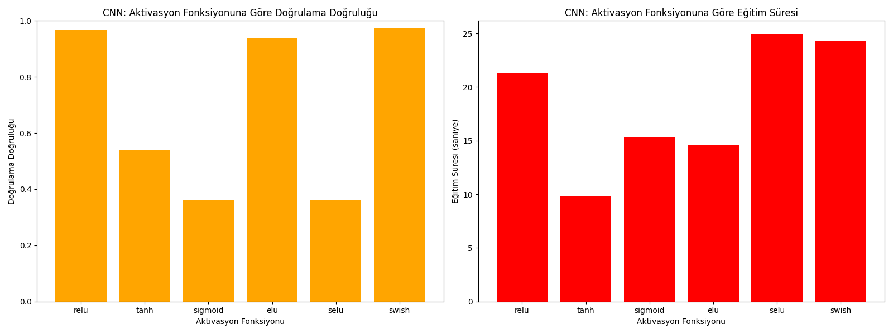

# Musical Instrument Classification using CNN and Transformer

This project implements two deep learning approaches to classify musical instruments from audio files:

1. **Convolutional Neural Network (CNN)** using Mel Spectrograms
2. **Transformer-based model** using Wav2Vec2 architecture

The models are trained to identify 3 different types of instruments:

- Guitar
- Drum
- Piano

[Türkçe README için buraya tıklayın (Click here for Turkish README)](README_tr.md)

## Project Structure

- `src/instrument_classifier.py`: Main script for extracting Mel Spectrograms, training the CNN model with data augmentation, evaluating performance, and saving the best model.
- `src/predict_instrument.py`: Script for predicting the class of a new audio file using the trained CNN model.
- `src/activation_comparison.py`: Script for comparing different activation functions within the CNN model architecture.
- `src/transformer_classifier.py`: Script for training and evaluating the Wav2Vec2 Transformer model on audio files.
- `src/model_comparison.py`: Script for comparing the performance of CNN and Transformer models.
- `requirements.txt`: Package dependencies.
- `data/metadata/Metadata_Train.csv`: CSV file with training data filenames and their corresponding instrument classes.
- `data/metadata/Metadata_Test.csv`: CSV file with test data filenames and their corresponding instrument classes.
- `data/raw/Train_submission/`: Directory containing training audio files.
- `data/raw/Test_submission/`: Directory containing test audio files.
- `results/`: Directory where trained models, evaluation results, and visualizations are saved.

## Features Extracted

The system primarily uses **Mel Spectrograms** derived from the audio files as input for the CNN model. The `instrument_classifier.py` script also includes code for extracting other features like MFCCs, spectral features, ZCR, RMS, Chroma, tempo, and harmonic/percussive components, although these are not directly used as input for the final CNN model in the current main script.

- **Mel Spectrograms**: Time-frequency representation suitable for CNNs.

Data augmentation techniques (noise addition, pitch shifting, time stretching) are applied during training to improve model robustness.

## Models Implemented

### CNN Model

The core of the first approach is a **Convolutional Neural Network (CNN)** designed to process Mel Spectrogram images. The architecture includes:

- Conv2D layers with Batch Normalization and Dropout for feature extraction.
- MaxPooling layers for downsampling.
- Flatten layer to transition to dense layers.
- Dense layers for classification.
- Softmax activation in the output layer for multi-class probability distribution.

The model uses the Adam optimizer and sparse categorical crossentropy loss. Early stopping is employed to prevent overfitting.

### Transformer Model

The second approach uses a **Transformer-based model** built on Facebook's Wav2Vec2 architecture:

- Utilizes pre-trained audio transformers for feature extraction
- Processes raw audio waveforms directly without manual feature extraction
- Fine-tuned for instrument classification task
- Custom implementation to handle compatibility issues with weight normalization

The transformer model leverages self-attention mechanisms to capture temporal relationships in audio data.

## Model Comparison

The `src/model_comparison.py` script evaluates and compares the performance of both CNN and Transformer models on the same test dataset. The comparison includes:

- Accuracy metrics for both models
- Class-wise precision, recall, and F1 scores
- Confusion matrices to visualize classification patterns
- Relative improvement analysis

Results indicate that the Transformer model achieves slightly better performance (73.33% accuracy) compared to the CNN model (70.00% accuracy), representing a 4.76% relative improvement.

## Activation Functions Comparison

The `src/activation_comparison.py` script trains and evaluates the CNN model using different activation functions to determine their impact on performance. The functions compared are:

- ReLU
- Tanh
- Sigmoid
- ELU
- SELU
- Swish

Results (accuracy and training time) are saved in `cnn_activation_results.csv` and visualized in `activation_comparison.png`.

## Test Results and Visualizations

The training process and evaluation generate several output files saved in the `results/` directory (and the root directory for comparison results):

### Confusion Matrix


Shows the performance of the best CNN model on the test dataset, detailing correct and incorrect predictions per class.

### CNN Training History



Plots the training and validation accuracy/loss over epochs for the CNN model.

### Activation Function Comparison



Visual comparison of validation accuracy and training time for different activation functions in the CNN.

## Usage

### Training the CNN Model

```bash
python src/instrument_classifier.py
```

This script will:

- Load training metadata.
- Extract Mel Spectrograms with data augmentation for training data.
- Extract Mel Spectrograms for validation data.
- Train the CNN model.
- Evaluate the model on the test set.
- Save the best model (`results/best_model_cnn.h5`), label encoder (`results/label_encoder.pkl`), confusion matrix (`results/confusion_matrix.png`), and training history (`results/cnn_training_history.png`).

### Predicting with the Trained Model

```bash
python src/predict_instrument.py path/to/your/audiofile.wav [--model results/best_model_cnn.h5] [--encoder results/label_encoder.pkl]
```

Loads the trained model and predicts the instrument class for the specified audio file.

### Training the Transformer Model

```bash
python src/transformer_classifier.py
```

This script will:

- Load training metadata
- Create the Wav2Vec2-based Transformer model
- Process audio files directly without extracting spectrograms
- Train the model on GPU (if available)
- Evaluate on test data
- Save model checkpoints and evaluation metrics

### Comparing Models

```bash
python src/model_comparison.py
```

This script will:

- Load both the CNN and Transformer models
- Evaluate them on the same test dataset
- Generate comparison metrics and visualizations
- Save results to the `results/comparison/` directory

## Installation

1.  Clone the repository (if you haven't already).
2.  Create and activate a virtual environment (recommended):
    ```bash
    python -m venv env
    source env/bin/activate  # On Windows use `env\Scripts\activate`
    ```
3.  Install dependencies:
    ```bash
    pip install -r requirements.txt
    ```
    _Note: `tensorflow[and-cuda]` requires appropriate NVIDIA drivers and CUDA toolkit installed if you want GPU acceleration._

## Results Files Generated

- `results/best_model_cnn.h5`: The trained CNN model.
- `results/label_encoder.pkl`: The fitted label encoder for instrument classes.
- `results/confusion_matrix.png`: Visualization of the CNN test set performance.
- `results/cnn_training_history.png`: Plot of CNN training/validation accuracy and loss.
- `results/transformer/model/`: Directory containing the saved Transformer model.
- `results/transformer/checkpoints/`: Directory containing Transformer model checkpoints from training.
- `results/transformer/transformer_confusion_matrix.png`: Visualization of Transformer test set performance.
- `results/transformer/transformer_training_history.png`: Plot of Transformer training/validation metrics.
- `results/comparison/model_comparison_confusion_matrix.png`: Side-by-side confusion matrices for both models.
- `results/comparison/model_accuracy_comparison.png`: Accuracy comparison visualization.
- `activation_comparison.png`: Visualization of activation function comparison results.
- `cnn_activation_results.csv`: Table comparing activation function performance.
